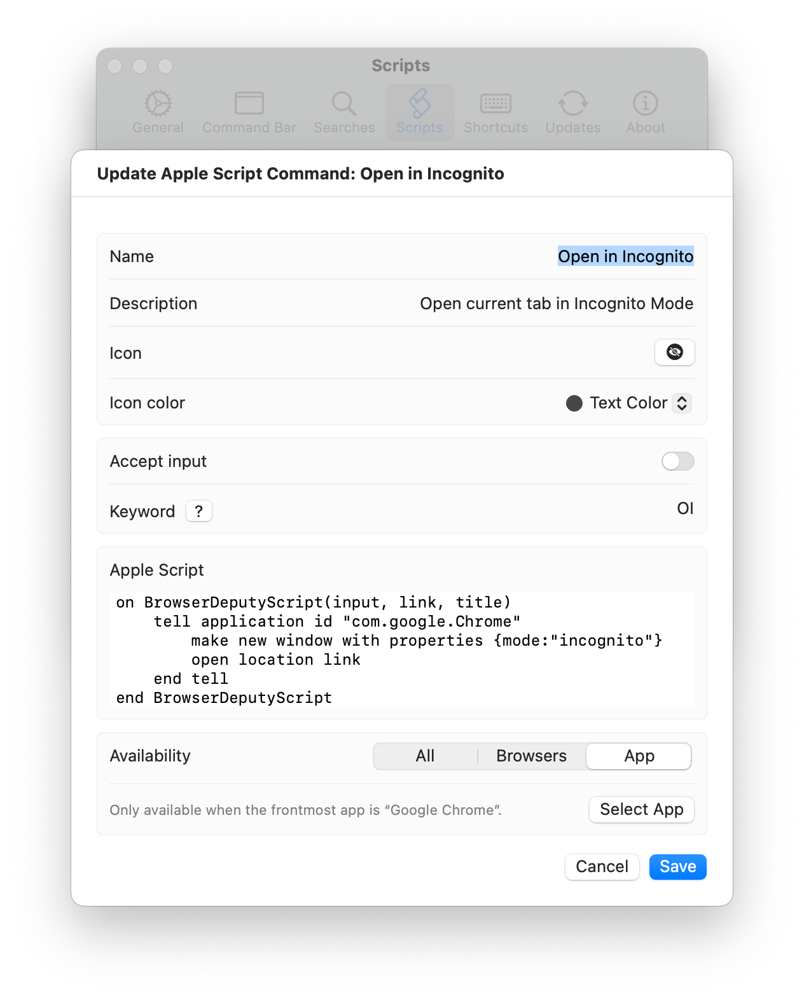

# Open in Incognito

Open current tab in Incognito Mode

```applescript
on BrowserDeputyScript(input, link, title)
    tell application id "com.google.Chrome"
        make new window with properties {mode:"incognito"}
        open location link
    end tell
end BrowserDeputyScript
```

## Settings



## Download

[Download open-in-incognito.json](./open-in-incognito.json)