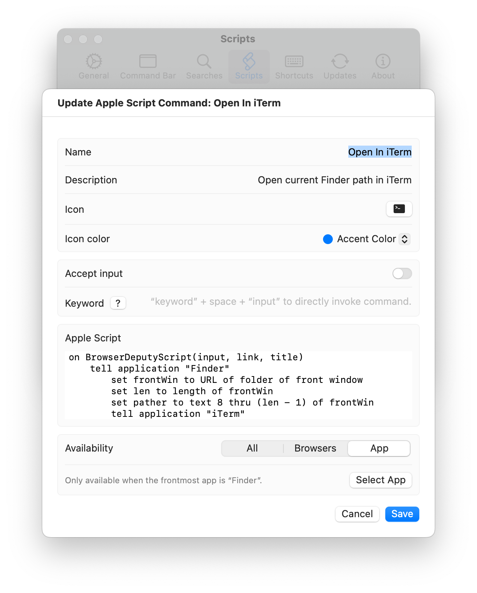

# Open In iTerm

Open current Finder path in iTerm

```applescript
on BrowserDeputyScript(input, link, title)
	tell application "Finder"
		set frontWin to URL of folder of front window
		set len to length of frontWin
		set pather to text 8 thru (len - 1) of frontWin
		tell application "iTerm"
			launch "iTerm"
			delay 1
			set newWindow to (create window with default profile)
			tell current session of newWindow
				write text "cd " & pather
			end tell
		end tell
	end tell
end BrowserDeputyScript
```

## Settings



## Download

[Download open-in-iterm.json](./open-in-iterm.json)